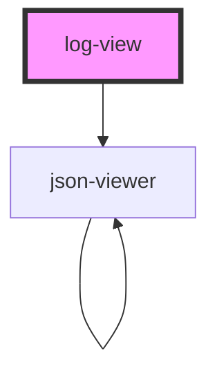

# log-view

<!-- Auto Generated Below -->

## Methods

### `error(title: string, body?: string) => Promise<void>`

#### Returns

Type: `Promise<void>`

### `instruction(title: string, body?: string) => Promise<void>`

#### Returns

Type: `Promise<void>`

### `request(url: string, body?: string | object) => Promise<void>`

#### Returns

Type: `Promise<void>`

### `response(url: string, body?: string | object) => Promise<void>`

#### Returns

Type: `Promise<void>`

## Dependencies

### Depends on

- [json-viewer](../jsonviewer)

### Graph

----------------------------------------------

*Built with [StencilJS](https://stenciljs.com/)*
