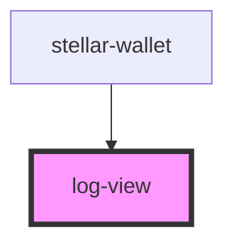

# log-view

<!-- Auto Generated Below -->

## Methods

### `error(text: string) => Promise<void>`

#### Returns

Type: `Promise<void>`

### `instruction(text: string) => Promise<void>`

#### Returns

Type: `Promise<void>`

### `request(url: any, body: any) => Promise<void>`

#### Returns

Type: `Promise<void>`

### `response(url: any, body: any) => Promise<void>`

#### Returns

Type: `Promise<void>`

## Dependencies

### Used by

 - [stellar-wallet](../wallet)

### Graph

----------------------------------------------

*Built with [StencilJS](https://stenciljs.com/)*
