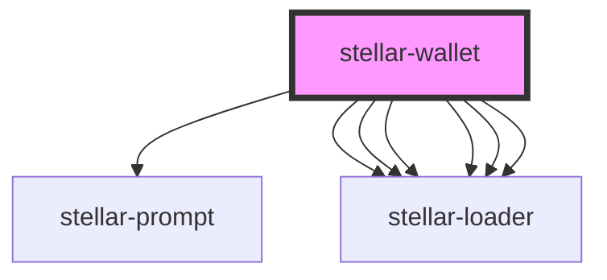

# stellar-wallet

<!-- Auto Generated Below -->

## Properties

| Property     | Attribute | Description | Type     | Default     |
| ------------ | --------- | ----------- | -------- | ----------- |
| `homeDomain` | --        |             | `String` | `undefined` |
| `server`     | --        |             | `Server` | `undefined` |
| `toml`       | --        |             | `Object` | `undefined` |

## Dependencies

### Depends on

- [stellar-prompt](../prompt)
- [stellar-loader](../loader)
- [stellar-loader](../loader)
- [stellar-loader](../loader)
- [stellar-loader](../loader)
- [stellar-loader](../loader)
- [stellar-loader](../loader)

### Graph

---

_Built with [StencilJS](https://stenciljs.com/)_
