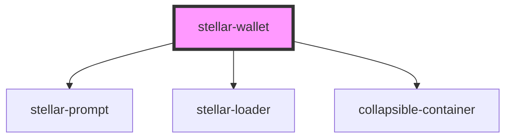

# stellar-wallet

<!-- Auto Generated Below -->

## Properties

| Property     | Attribute     | Description | Type      | Default                                             |
| ------------ | ------------- | ----------- | --------- | --------------------------------------------------- |
| `homeDomain` | `home-domain` |             | `string`  | `'testanchor.stellar.org'`                          |
| `logger`     | --            |             | `ILogger` | `MockLogger`                                        |
| `server`     | --            |             | `Server`  | `new Server('https://horizon-testnet.stellar.org')` |
| `toml`       | `toml`        |             | `any`     | `undefined`                                         |

## Dependencies

### Depends on

- [stellar-prompt](../prompt)
- [stellar-loader](../loader)
- [collapsible-container](views)

### Graph

----------------------------------------------

*Built with [StencilJS](https://stenciljs.com/)*
