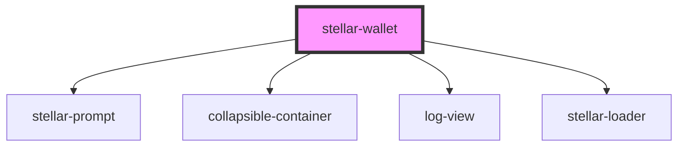

# stellar-wallet

<!-- Auto Generated Below -->

## Properties

| Property     | Attribute     | Description | Type     | Default                                             |
| ------------ | ------------- | ----------- | -------- | --------------------------------------------------- |
| `homeDomain` | `home-domain` |             | `string` | `'testanchor.stellar.org'`                          |
| `server`     | --            |             | `Server` | `new Server('https://horizon-testnet.stellar.org')` |
| `toml`       | `toml`        |             | `any`    | `undefined`                                         |

## Dependencies

### Depends on

- [stellar-prompt](../prompt)
- [collapsible-container](views)
- [log-view](../logview)
- [stellar-loader](../loader)

### Graph

----------------------------------------------

*Built with [StencilJS](https://stenciljs.com/)*
